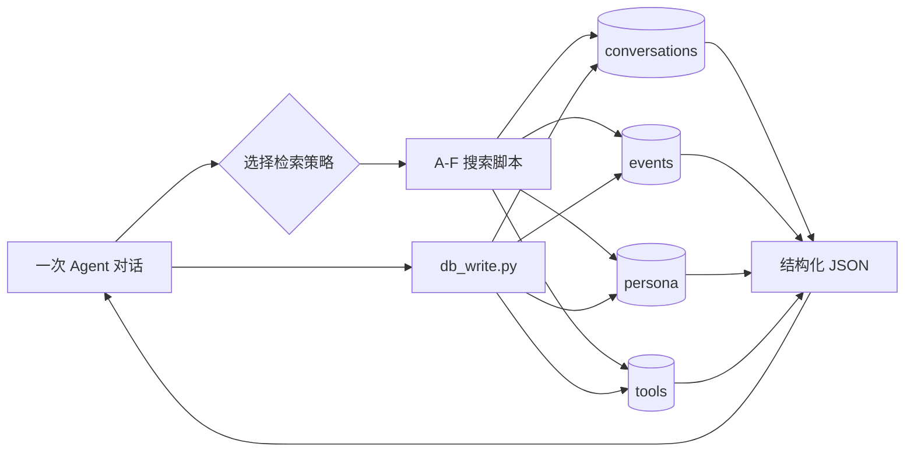

# Agent Memory Skill

[](https://github.com/llwwds/agent-memory-skill/actions/workflows/tests.yml)
[](LICENSE)

一个本地优先、基于 SQLite 的 Codex 长期记忆 skill。它把对话、事件、用户画像和工具链拆到 4 个数据库中，再用多值标签和 6 种检索策略把这些信息重新关联起来。

项目只管理 skill、schema 和 CLI，不上传个人记忆数据库。

## 为什么这样设计

普通聊天记录适合回看，但不适合精确回答“这个项目过去做过什么”“某台设备现在装了哪些工具”。本项目把长期记忆拆成四类事实源：

| 数据库 | 保存什么 | 典型问题 |
| --- | --- | --- |
| `conversations.db` | 对话原文、摘要、事件标签、设备 | 这个项目过去讨论过什么？ |
| `events.db` | 项目或主题的概览、里程碑、父事件 | 这件事现在进展到哪一步？ |
| `persona.db` | 偏好、目标、项目路径规范 | 用户希望 Agent 怎么做？ |
| `tools.db` | 工具、设备、部署方式、使用手册 | 这台机器上有哪些可用工具？ |

每个数据库都有 `_tag_pool` 标签池。Agent 在读写前先查询已有标签，避免同一个概念被写成多个近义标签。



## 设计理念：为什么封装成 Skill 而不是做成 Plugin

这个项目刻意封装成 skill，而不是做成 plugin。核心理由只有一句：

> 都是封装，skill 更容易同时兼容 Codex 和 Claude，开发和测试花的 token 一般更少。

展开说：

- **封装的目标是整个 workflow，不是打磨 prompt。** 前期探索和总结创新真正需要优化的是流程（什么时候查标签池、什么时候拉画像、什么时候写回），把这套流程连同 schema、CLI 一起封装成 skill，目的就达到了。继续往 plugin 方向堆功能，往往是在打磨 prompt 措辞，收益递减。
- **一套文件，两端通用。** skill 的入口是 `SKILL.md` 加脚本，Codex 和 Claude 都能直接加载同一份目录；plugin 通常要绑定某一端的运行时和配置格式，跨端时容易被迫维护两套。
- **简单优先。** 除非出现新的、skill 表达不了的需求，否则都以简单优先——能靠几个 Python 脚本 + 一份 schema 解决，就不引入额外运行时。

## 特性

- 仅依赖 Python 标准库，核心数据存放在本地 SQLite。
- 4 个职责清晰的数据库，不把所有记忆塞进一张表。
- JSON 数组形式的多值标签，支持一个对话关联多个事件。
- A-F 六种独立检索入口，覆盖事件过滤、关键词、跨层、联合、交叉和反向关联。
- 写入时自动补齐 `created_at`、`updated_at`，删除始终是软删除。
- SQLite WAL + 5 秒 busy timeout，适合多个 Agent 进程短时并发读写。
- Windows、macOS 均可运行，并可用 `AGENT_MEMORY_DB_DIR` 指定数据库目录。

## 快速开始

要求 Python 3.9 或更高版本。

```bash
git clone https://github.com/llwwds/agent-memory-skill.git
cd agent-memory-skill
```

可选：指定记忆库目录。不设置时，Windows 默认使用 `C:\llwwds_file\memory`，macOS/Linux 默认使用 `~/Documents/memory`。

```bash
export AGENT_MEMORY_DB_DIR="$HOME/Documents/memory"
python scripts/db_init.py
```

PowerShell：

```powershell
$env:AGENT_MEMORY_DB_DIR = "C:\llwwds_file\memory"
python scripts/db_init.py
```

初始化会创建 4 个数据库、索引、`_tag_pool` 表和一组基础标签，不会覆盖已有记录。

## 安装为 Codex Skill

把仓库复制或克隆到 Codex 的 skills 目录，并保持目录名为 `agent-memory-skill`：

```text
~/.codex/skills/agent-memory-skill/
├── SKILL.md
├── agents/openai.yaml
├── references/schema.md
└── scripts/
```

重启 Codex 后可通过 `$agent-memory-skill` 显式调用。`SKILL.md` 同时定义了每次对话开始和结束时的记忆工作流。

## 如何在系统提示词里加几句话以实现自动化

显式调用 `$agent-memory-skill` 需要你每次记得敲一遍。更省事的做法是在系统提示词（或 Codex 的全局 AGENTS.md / Claude 的 CLAUDE.md）里加几句规则，让 Agent 在固定时机自动跑记忆脚本，无需人工触发。

`agents/openai.yaml` 里已经设了 `allow_implicit_invocation: true`，意味着 Agent 可以隐式调用本 skill；下面这几句话只是把"什么时候该调用"讲清楚，让自动化稳定发生。

把下面这段直接粘进系统提示词即可（脚本路径用相对 `scripts/...`，依赖 skill 目录被正确加载）：

```text
长期记忆规则：
- 对话开始时，先查标签池再拉上下文：
  1. python scripts/db_query.py --db events --list-tags --column name
  2. python scripts/db_query.py --db persona --limit 50
  3. 按当前话题，从 A-F 中选 1-2 个检索脚本拉相关历史。
- 对话结束前，把本次要点写回：
  1. python scripts/db_write.py --db conversations --action insert --data <JSON>
  2. 若有进展，更新 events 的 overview/milestones。
  3. 若涉及工具链变更，更新 tools 表 status。
- 任何删除只走软删除（status 改为 不存在），不物理删除。
- 读写前先 --list-tags 查标签池，复用已有标签，不要新建近义标签。
```

这几句话为什么够用：

| 规则 | 对应的自动化效果 |
| --- | --- |
| 对话开始时查标签池 + 拉画像 | Agent 每次开机就拿到"有哪些事件/项目""用户是谁"，不用你手动喂上下文 |
| 结束时写回 conversations + 更新 events/tools | 每轮对话自动沉淀，记忆持续累积，不会漏记 |
| 只走软删除 + 先查标签池 | 防止 Agent 误删原始数据，也防止它把同一概念写成多个近义标签污染索引 |

如果你的系统提示词对 token 敏感，可以只保留"对话开始时查标签池+拉上下文"和"对话结束时写 conversations"这两条——它们是自动化的最小闭环；其余规则可留在 `SKILL.md` 里作为 skill 自带说明，Agent 调用 skill 时会读到。

## 常用操作

先看标签池，再查询或写入：

```bash
python scripts/db_query.py --db events --list-tags --column name
python scripts/db_query.py --db persona --limit 50
python scripts/db_query.py --db tools --list-tags --column device
```

写入一条对话。时间戳由脚本自动生成：

```bash
python scripts/db_write.py \
  --db conversations \
  --action insert \
  --data '{"content":"完成 README 重写并发布","summary":"公开发布项目","event":["sqlite_memory_skill项目"],"device":"macbook","status":"存在"}'
```

精确更新记录：

```bash
python scripts/db_write.py \
  --db events \
  --action update \
  --id 4 \
  --set '{"status":"已完成"}'
```

软删除记录：

```bash
python scripts/db_write.py --db tools --action delete --id 3
```

`delete` 不会执行 SQL `DELETE`，只会更新 `status` 和 `updated_at`。

## A-F 检索策略

| 策略 | 脚本 | 用途 |
| --- | --- | --- |
| A | `search_event.py` | 按事件标签筛选对话或工具 |
| B | `search_content.py` | 在文本字段中做关键词搜索 |
| C | `search_cross.py` | 先匹配事件概览，再反查相关对话 |
| D | `search_hybrid.py` | 同时限定事件标签和内容关键词 |
| E | `search_tags.py` | 用多个标签做 AND 交叉过滤 |
| F | `search_related.py` | 从一条对话出发，查共享事件标签的对话 |

```bash
# A：某项目的全部对话
python scripts/search_event.py --event sqlite_memory_skill项目 --status 存在

# B：不确定内容属于哪个项目
python scripts/search_content.py --db events --q SQLite

# C：事件 -> 对话
python scripts/search_cross.py --q memory

# D：项目内搜索某个话题
python scripts/search_hybrid.py --event sqlite_memory_skill项目 --q README

# E：设备 + 事件 + 状态交叉过滤
python scripts/search_tags.py \
  --db tools \
  --device m1macbook \
  --event 工具链 \
  --status 存在

# F：查与对话 220 共享事件标签的记录
python scripts/search_related.py --id 220
```

所有查询输出 UTF-8 JSON，方便 Agent 继续解析。

## 数据模型

完整建表语句见 [`references/schema.md`](references/schema.md)。多值字段以 JSON 数组文本保存在 SQLite 中：

```json
{
  "event": ["sqlite_memory_skill项目", "工具链"],
  "device": ["m1macbook"],
  "deployment": ["本地", "Codex App"]
}
```

当前实现使用 SQL `LIKE` 搜索序列化后的多值字段。这种方式轻量、便于直接检查数据库，但它是子串匹配，不是严格的 JSON 成员索引。标签量或数据量明显增大后，应考虑 SQLite JSON1 或关系型关联表。

## 项目结构

```text
agent-memory-skill/
├── SKILL.md                  # Skill 入口与 Agent 工作流
├── README.md                 # 项目说明
├── agents/openai.yaml        # Codex 展示与调用配置
├── references/schema.md      # 4 个数据库的 SQL schema
├── scripts/
│   ├── db_init.py            # 初始化数据库、索引和标签池
│   ├── db_utils.py           # 路径、连接、序列化和标签同步
│   ├── db_query.py           # 通用查询与标签池查询
│   ├── db_write.py           # insert / update / soft delete
│   ├── db_migrate.py         # 旧 Markdown persona 迁移工具
│   ├── db_query_core.py      # A/B/D/E 共用查询内核
│   └── search_*.py           # A-F 六种检索策略
├── tests/                    # 标准库 unittest 冒烟测试
└── docs/                     # 现有问题和路线图
```

## 当前边界

- 这是轻量个人记忆基础设施，不是向量数据库或 RAG 框架。
- 多值标签目前依赖 JSON 文本 + `LIKE`，存在子串误匹配的可能。
- `db_migrate.py` 只实现了旧 persona Markdown 的迁移，tools 迁移仍需人工审计。
- CLI 写入 JSON 会受 shell 转义规则影响；复杂内容建议由调用方使用 `subprocess` 参数数组，而不是拼接命令字符串。
- 数据库 schema 没有跨库外键，跨层一致性由 Agent 工作流维护。

## 测试

测试只使用临时目录，不会访问真实记忆库：

```bash
python -m unittest discover -s tests -v
```

## 安全与数据

- 不要把真实 `*.db`、`*.db-wal`、`*.db-shm` 提交到 Git。
- 执行大规模更新前先备份整个记忆库目录。
- 删除记录必须走软删除语义；需要恢复时把 `status` 改回有效状态。
- 记忆内容可能含私人信息。公开仓库只应包含代码和脱敏示例。

## License

[MIT](LICENSE)
